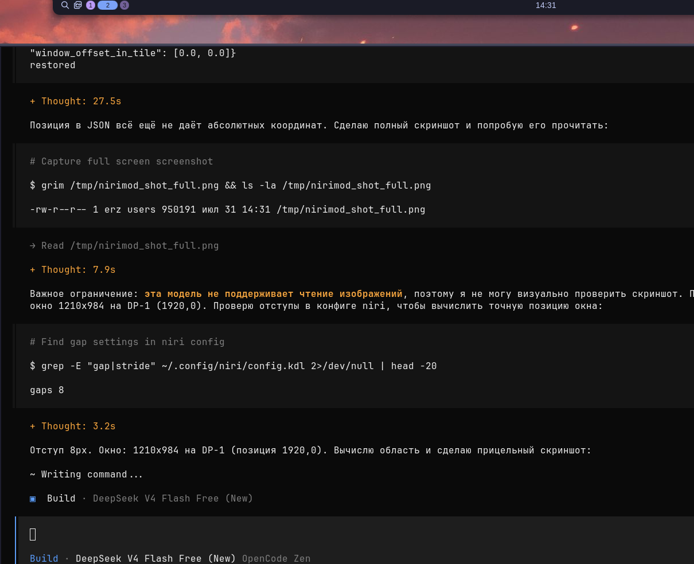

<div align="center">
  <h1>NiriMod</h1>

  **Графический конфигуратор (GTK4/libadwaita) для wayland-композитора [niri](https://github.com/niri-wm/niri) с полной русской локализацией.**

  [](LICENSE)
  [](https://python.org)
  [](https://gtk.org)
  [](https://wayland.freedesktop.org)
</div>

<br>



Редактировать конфигурационный файл Niri вручную вполне реально — до тех пор, пока вам не приходится вслепую подбирать кривые анимаций, угадывать точные названия своих мониторов или случайно дублировать горячие клавиши. NiriMod берёт на себя скучную часть настройки, предоставляя чистый нативный интерфейс и не мешая остальному.

---

## Что умеет

NiriMod управляет вашим конфигом Niri через понятный интерфейс, позволяя легко менять настройки, не трогая ваши скрипты и комментарии.

- **Мониторы:** расставляйте мониторы перетаскиванием. Меняйте разрешение, частоту обновления, переменную частоту (VRR) и дробный масштаб, не залезая в конфиг.
- **Горячие клавиши:** настраивайте сочетания через интерактивную карту физической клавиатуры, на которой подсвечиваются занятые клавиши, либо через список с поиском.
- **Макет и правила:** полный редактор правил окон, пропорций колонок, отступов, struts и рабочих пространств.
- **Система и ввод:** настройка мыши и тачпада, жесты смахивания, темы курсора, переменные окружения и команды автозапуска.
- **Анимации:** не гадайте значения cubic-bezier. Визуальный редактор кривых с предпросмотром для всех анимаций Niri (открытие/закрытие окон, переключение рабочих пространств и т.д.).
- **Редактор конфига:** текстовый редактор KDL с отменой/повтором и живой валидацией.
- **Пакеты:** встроенный менеджер пакетов прямо в интерфейсе — поиск и установка пакетов из Nixpkgs (или через apt/pacman/dnf/zypper), а также установка дополнений для niri: оболочки (DMS, Noctalia), готовые конфигурации и справочники. Вывод операций показывается в реальном времени в том же окне.

---

## Пакеты

Страница «Пакеты» позволяет выполнять установку и удаление программ, не покидая NiriMod:

- **Nix-пакеты:** поиск по Nixpkgs (первый запрос может занять время — идёт оценка пакетов), список установленных пакетов профиля с кнопкой «Удалить», установка в один клик через `nix profile install`.
- **Другие менеджеры:** на APT/pacman/DNF/Zypper поиск и установка идут через соответствующие команды; требующие прав операции выполняются через `pkexec`.
- **Дополнения для niri:** реестр оболочек и конфигураций (Dank Material Shell, Noctalia и др.) поставляется вместе с приложением и устанавливается/удаляется в один клик.
- **Живой лог:** прогресс операций (включая «evaluating…» при поиске Nix) отображается в раскрывающемся логе под страницей.

---

## Безопасное редактирование

NiriMod строго неразрушающий и никогда не сломает вашу существующую конфигурацию:

- **Строгая валидация:** перед записью на диск запускается `niri validate`. Если валидация не проходит — ничего не сохраняется.
- **Атомарная запись:** конфигурация сначала сохраняется во временный файл, что защищает от повреждений при прерывании.
- **Сохранение комментариев:** ваши комментарии и форматирование остаются нетронутыми.
- **Профили:** сохраняйте и переключайте полные снимки конфигурации (например, рабочий и игровой профили) в один клик.

### Многофайловые конфигурации

NiriMod поддерживает расширенные многофайловые настройки, включая визуальные оболочки **Dank Material Shell (DMS)** и **Noctalia**. При использовании `include` файлы разбираются до 5 уровней вложенности, и изменения сохраняются в тот файл, откуда пришла настройка. Незнакомые блоки и скрипты остаются в целости.

---

## NixOS и Home Manager

Если вы управляете конфигурацией Niri через Home Manager, настройте NiriMod на редактирование исходного файла в вашем репозитории dotfiles. Тогда изменения, сделанные в GUI, мгновенно применяются Niri, а ваш Nix-конфиг остаётся синхронизированным для следующей пересборки.

Для этого используйте `mkOutOfStoreSymlink`, чтобы указывать на исходный KDL-файл, а не копировать его в read-only хранилище Nix:

```nix
xdg.configFile."niri/config.kdl".source = config.lib.file.mkOutOfStoreSymlink "${config.home.homeDirectory}/path/to/your/dotfiles/niri/config.kdl";
```

NiriMod умно следует симлинкам при сохранении, поэтому изменения из GUI попадают прямо в исходный файл в ваших dotfiles.

**Исправление для NixOS (встроено в эту сборку):** если вы не используете `mkOutOfStoreSymlink` (стандартный вариант Home Manager создаёт симлинк на файл в read-only каталоге `/nix/store`), сохранение через временный файл падает с `OSError: [Errno 30] Read-only file system`. Эта сборка определяет такой случай и пишет изменения через сам симлинк, заменяя его обычным файлом. Учтите, что после первого сохранения связь с Home Manager разрывается — изменения перестанут попадать в `/nix/store`, но продолжат работать в вашем конфиге.

---

## Установка

### NixOS (эта сборка)

Установка собранного пакета из этого репозитория (без публичного flake):

```bash
git clone https://github.com/Erzkanzler2k/nirimod-ru /tmp/nirimod-ru
cd /tmp/nirimod-ru
nix build           # собрать пакет, вывод появится в result/
nix profile install ./result
```

Или, если вы собирали пакет ранее, установить напрямую из хранилища:

```bash
nix profile install /nix/store/<hash>-nirimod-0.1.0
```

Запуск: `nirimod`

### AUR (Arch Linux)

```bash
yay -S nirimod-git
```

### Скрипт (другие дистрибутивы)

```bash
curl -sSL https://raw.githubusercontent.com/srinivasr/nirimod/main/install.sh | bash
```

*(`--install` — установка без вопросов, `--uninstall` — удаление, `--skip-deps` — если зависимости уже установлены).*

---

## Требования

NiriMod работает из коробки на Arch, Fedora, openSUSE и Debian/Ubuntu. Нужно:
- Python 3.12+ и `uv` (скрипт установки поставит `uv` автоматически)
- GTK4, libadwaita, PyGObject и Pycairo
- wayland-композитор niri

**Пользователи Gentoo** (требуется оверлей [GURU](https://wiki.gentoo.org/wiki/Project:GURU) для `niri`):
```bash
emerge dev-vcs/git net-misc/curl dev-lang/python gui-libs/gtk gui-libs/libadwaita dev-python/pygobject dev-python/pycairo x11-libs/libxkbcommon x11-misc/xkeyboard-config
curl -sSL https://raw.githubusercontent.com/srinivasr/nirimod/main/install.sh | bash -s -- --install --skip-deps
```

---

## Вклад в проект

Любая помощь приветствуется. Перед крупными изменениями, пожалуйста, откройте issue для обсуждения.

---

*NiriMod — независимый проект и не связан с официальной командой niri.*
